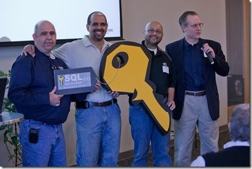

Note: this site is under construction and will change over time.

SQL Saturday was the brainchild of Andy Warren, Brian Knight, and Steve Jones.

The idea was to bring the conference experience to local areas, with grassroots organization and a free day of training supplied by speakers, and supported by sponsors. 

Saturday was chosen as this was the day when the community could attend without interfering with work, and many schools, universities, and other spaces would have space available at a low or no cost.

While these events were originally intended to support the SQL Server platform and those that work with it with events on Saturdays, the events have expanded to take place on most days of the week and encompass many other technologies and platforms that are data related.

All of these events are the result of many organizers, volunteers, and speakers that have donated time and resources to ensure their local events would be a success. SQL Saturday could not succeed without their efforts.

Read more about the [history](#history) and [milestones](#milestone) of the franchise.

## History

The first event was in Orlando, on November 11, 2007. Since that date, over 1,000 events have taken place worldwide.

The goal of these events was to allow local organizers to run a free event for their local community.

The franchise was built to help them with marketing, mentoring, and tools that faciltated the execution of each event. The initial goals were to use local speakers, keep costs low, and allow sponsors to reach an audience they might not otherwise get the chance to interact with. The evolution of the events included the addition of pre-cons on the days before events as well as a lunch fee to enable organizers to defray the costs of providing lunch.

### The Second Evolution of SQL Saturday

[SQL Saturday #33 - Charlotte](./events/2010-3-6-SQLSat-0033.html), the franchise was handed over to the PASS organization to manage and support.

PASS continued to support the franchise and assist local organizers in running events. They hired a community liason, [Karla Landrum](https://twitter.com/karlakay22), who promoted and mentored event organizers around the world. With their support, the franchise grew to run over 100 events in a single year.

PASS also hired [Nico Neugebauer](http://twitter.com/NikoNeugebauer) to help grow the franchise outside of the US. With his and Karla's efforts, there were many more events that took place around the world.

### The Third Evolution of SQL Saturday

PASS rebranded themselves and the site, changing logos, and adding a few requirements. They instituted a global partner program to allow large vendors to support many events by donating money to the program and having PASS distribute the money to local organizers.