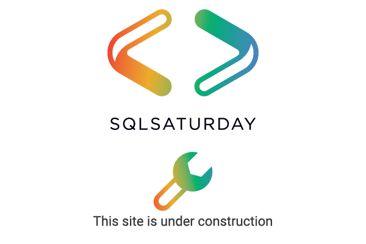

This page is designed to help you setup and request a new SQL Saturday event. As with the rest of the site, this is a work in progress and under construction.

There are a few simple steps to get your event set up on the site:

- Gather information about the event (see our checklist below)
- Submit this to this site
- Sign the contract for using the SQL Saturdy name

That's it. Once you have the signed agreement and the information submitted, we will update this site with your event.

Note that the contract is a temporary one with Redgate Software until the SQL Saturday Foundation is legally established.

Numbers for new events are assigned on a first come basis once the event is added to the system. Once an administrator adds a pull request for your event, the number is assigned and used for your event. Future events will get subsequent numbers. 

You can, however, name your event anything after the SQL Saturday #xxx part. For example if you want an edition, you can so something like:
- SQL Saturday #2000 - Atlanta - BI Edition
- SQL Saturday #2000 - Denver Azure Edition
- Data Saturday #10/SQL Saturday #2000 - LA
- SQL Saturday #2000 - Diversity and Inclusion Edition

You can even theme these events without a city or physical location, such as the last item in the list above.

Once you have the information for your event, please [open an issue in the GitHub repository](https://github.com/red-gate/sql-saturday-website/issues) with the title of your event. Provide the information in your issue from the checklist below.

We have a [checklist in an Excel file](#checklist) below of items you need as well as [guidance](#guidance) to help you run your event.

## New Event Checklist

These items are kept in an [Excel spreadsheet](./assets/EventChecklist.xlsx) to make them easy for you to track. You can download the XLSX and fill it out before submitting as a part of your issue.

The basic information required to set up an event is:

- Event Title (required) - We will prepend this with "SQL Saturday #xxx - ", based on the number assigned.
- Event Date (required)
- Event Time (optional) - In local time or UTC. Please specify which you use. We will publish the initial event without a time, but this needs to be updated at some point prior to the event.
- Event description (required) - The text to be used on your event page.
- Event Location (required) - Virtual or the address/city.
- Event URL (optional) - If you wish to maintain your own event page. We can redirect to your page.
- Logo URL (optional) - If you want something other than the [default logo](assets/img/logos/sqlsaturday_logo.png). Please include a small 200x100, and full size versions.
- Speaker CFP URL (optional) - How do speakers submit sessions.
- Speaker CFP End Date (optional) - If included, add the time and time zone.
- Registration URL for attendees (optional) - Optional to start, but this is needed at some point.
- Sponsor Plan URL (optional) - If you are selling sponsorships to raise money.
- Organizer name(s) (required) - Can be an individual(s) or a group name.
- Contact email (required) - Please feel free to message an admin if you do not with to post this.

Any other information you wish to include, please feel free. Once the event is live, if you need something changed, please update your issue. You can also submit a pull request (PR) if you want to make your own changes to the page.

If you are unsure of how or what to include for these items, we have some [guidance](#guidance) below. You can also feel free to reach out to the foundation using the email link at the bottom of this page.

If there are any ommissions or corrections for this list, please the webmaster below.